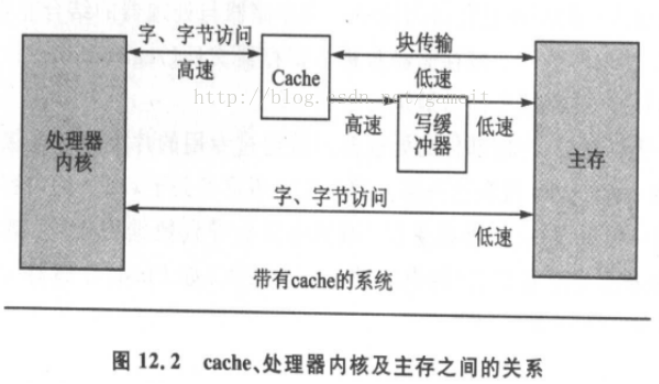

# MMU

### MMU的作用
- MMU能控制应用程序的权限，使应用程序只能访问自己的地址
- MMU能把虚拟地址转换成物理地址，应用程序使用虚拟地址，然后MMU把虚拟地址转换成物理地址从而获取内存中的数据

### MMU的地址转换
- MMU根据CPU发来的虚拟地址去内存的页表中查找一级页表项，根据一级叶表项里的内容判断是否查找二级页表项还是直接可以计算得出物理地址

### cache和buffer

- CPU的速度比内存快，所以需要加入cache(高速缓存，速度快的内存)
- buffer是写内存的时候，cache先把数据写到buffer中，让buffer慢慢把数据写入内存
