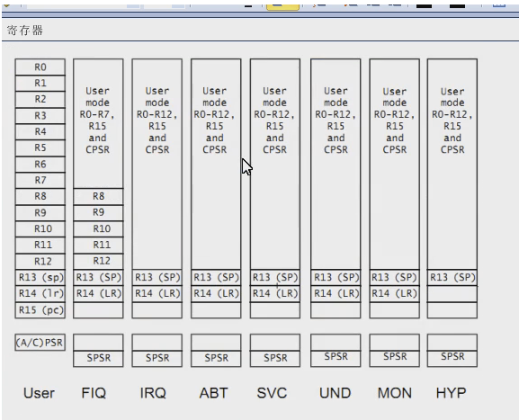

# ARM笔记

## CPU工作状态
- ARM状态
- THumb状态

### 模式
- 用户模式(USR):正常程序执行模式,不能直接切换到其他模式
- 系统模式(SYS):运行操作系统特权任务，与用户模式类似，但具有可以直接切换到其他模式等特权
- 快中断模式(FIQ):支持高速数据传输及通道处理，FIQ异常响应时进入此模式
- 中断模式(IRQ):用于通用中断处理，IRQ异常响应时进入此模式
- 管理模式(SVC):操作系统保护模式，系统复位和软件中断响应时进入此模式（由系统调用执行软中断SWI命令触发）
- 中止模式(ABT):用于支持虚拟内存或存储器保护，在ARM7TDMI没大用处
- 未定义模式(UND):支持硬件协处理器软件仿真，未定义指令异常响应时进入此模式

### 寄存器

- 寄存器R15被用作程序计数器，也称为PC，其值等于当前正在执行指令的地址+8（因为在取址和执行之间多了一个译码阶段）

### 寻址方式
- 立即数寻址
- 寄存器寻址
- 寄存器间接寻址
- 基址变址寄存器
- 多寄存器寻址
- 相对寻址
- 堆栈寻址

### linux操作系统和arm工作模式
首先，ARM开发板在刚上电或复位后都会首先进入SVC即管理模式，此时、程序计数器R15-PC值会被赋为0x0000 0000；bootloader就是在此模式下，位于0x0000 0000的NOR FLASH或SRAM中装载的，因此、开机或重启后bootloader会被首先执行。
    接着，bootloader引导Linux内核，此时、Linux内核一样运行在ARM的SVC即管理模式下；当内核启动完毕、准备进入用户态init进程时，内核将ARM的当前程序状态CPSR寄存器M[4:0]设置为10000、进而用户态程序只能运行在ARM的用户模式。
    由于ARM用户模式下对资源的访问受限，因此、可以达到保护Linux操作系统内核的目的。
    需要强调的是：Linux内核态是从ARM的SVC即管理模式下启动的，但在某些情况下、如：硬件中断、程序异常（被动）等情况下进入ARM的其他特权模式，这时仍然可以进入内核态（因为就是可以操作内核了）；同样，Linux用户态是从ARM用户模式启动的，但当进入ARM系统模式时、仍然可以操作Linux用户态程序（进入用户态，如init进程的启动过程）。
    即：Linux内核从ARM的SVC模式下启动，但内核态不仅仅指ARM的SVC模式（还包括可以访问内核空间的所有ARM模式）；Linux用户程序从ARM的用户模式启动，但用户态不仅仅指ARM的用户模式首先，ARM开发板在刚上电或复位后都会首先进入SVC即管理模式，此时、程序计数器R15-PC值会被赋为0x0000 0000；bootloader就是在此模式下，位于0x0000 0000的NOR FLASH或SRAM中装载的，因此、开机或重启后bootloader会被首先执行。
    接着，bootloader引导Linux内核，此时、Linux内核一样运行在ARM的SVC即管理模式下；当内核启动完毕、准备进入用户态init进程时，内核将ARM的当前程序状态CPSR寄存器M[4:0]设置为10000、进而用户态程序只能运行在ARM的用户模式。
    由于ARM用户模式下对资源的访问受限，因此、可以达到保护Linux操作系统内核的目的。
    需要强调的是：Linux内核态是从ARM的SVC即管理模式下启动的，但在某些情况下、如：硬件中断、程序异常（被动）等情况下进入ARM的其他特权模式，这时仍然可以进入内核态（因为就是可以操作内核了）；同样，Linux用户态是从ARM用户模式启动的，但当进入ARM系统模式时、仍然可以操作Linux用户态程序（进入用户态，如init进程的启动过程）。
    即：Linux内核从ARM的SVC模式下启动，但内核态不仅仅指ARM的SVC模式（还包括可以访问内核空间的所有ARM模式）；Linux用户程序从ARM的用户模式启动，但用户态不仅仅指ARM的用户模式首先，ARM开发板在刚上电或复位后都会首先进入SVC即管理模式，此时、程序计数器R15-PC值会被赋为0x0000 0000；bootloader就是在此模式下，位于0x0000 0000的NOR FLASH或SRAM中装载的，因此、开机或重启后bootloader会被首先执行。
    接着，bootloader引导Linux内核，此时、Linux内核一样运行在ARM的SVC即管理模式下；当内核启动完毕、准备进入用户态init进程时，内核将ARM的当前程序状态CPSR寄存器M[4:0]设置为10000、进而用户态程序只能运行在ARM的用户模式。
    由于ARM用户模式下对资源的访问受限，因此、可以达到保护Linux操作系统内核的目的。
    需要强调的是：Linux内核态是从ARM的SVC即管理模式下启动的，但在某些情况下、如：硬件中断、程序异常（被动）等情况下进入ARM的其他特权模式，这时仍然可以进入内核态（因为就是可以操作内核了）；同样，Linux用户态是从ARM用户模式启动的，但当进入ARM系统模式时、仍然可以操作Linux用户态程序（进入用户态，如init进程的启动过程）。
    即：Linux内核从ARM的SVC模式下启动，但内核态不仅仅指ARM的SVC模式（还包括可以访问内核空间的所有ARM模式）；Linux用户程序从ARM的用户模式启动，但用户态不仅仅指ARM的用户模式首先，ARM开发板在刚上电或复位后都会首先进入SVC即管理模式，此时、程序计数器R15-PC值会被赋为0x0000 0000；bootloader就是在此模式下，位于0x0000 0000的NOR FLASH或SRAM中装载的，因此、开机或重启后bootloader会被首先执行。
    接着，bootloader引导Linux内核，此时、Linux内核一样运行在ARM的SVC即管理模式下；当内核启动完毕、准备进入用户态init进程时，内核将ARM的当前程序状态CPSR寄存器M[4:0]设置为10000、进而用户态程序只能运行在ARM的用户模式。
    由于ARM用户模式下对资源的访问受限，因此、可以达到保护Linux操作系统内核的目的。
    需要强调的是：Linux内核态是从ARM的SVC即管理模式下启动的，但在某些情况下、如：硬件中断、程序异常（被动）等情况下进入ARM的其他特权模式，这时仍然可以进入内核态（因为就是可以操作内核了）；同样，Linux用户态是从ARM用户模式启动的，但当进入ARM系统模式时、仍然可以操作Linux用户态程序（进入用户态，如init进程的启动过程）。
    即：Linux内核从ARM的SVC模式下启动，但内核态不仅仅指ARM的SVC模式（还包括可以访问内核空间的所有ARM模式）；Linux用户程序从ARM的用户模式启动，但用户态不仅仅指ARM的用户模式
